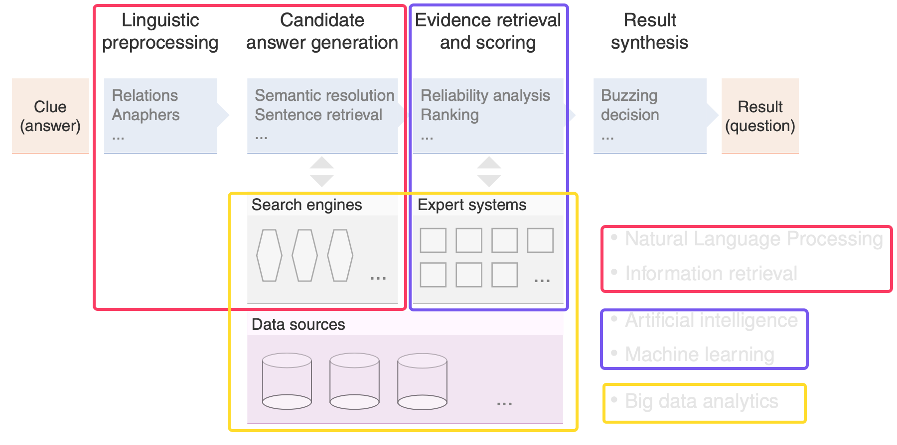

Literature: [Speech and Language Processing](https://web.stanford.edu/~jurafsky/slp3/) 

# 1. Intro

- Examples of NLP Systems

  

  - Natural Language Processing + Information retrieval
  - Artificial Intelligence + Machine Learning 
  - Big data analytics

- NLP Problems

  - Search Engines
  - Information Extraction
  - Review Analysis
  - Machine Translation
  - Knowledge and Information Management
  - State of Affairs: Mostly Sloved
    - 
  - State of Affairs: Making Good Progress
    - 
  - State of Affairs: Still Challenging
    - 

## Linguistic Levels

## Terminology

- Alphabet: $A = \{ l_1, l_2, ..., l_k\}$ 
  Let *NL* be a natural language, let *A* be a set of characters
  $A$ is an alphabet of *NL* of size *k* 

  - Example: $A_E = \{a,b,...,z\}$ , $k_E = 26$ 

- String: Tuple $t = <l_1, l_2, ..., l_n>$ , $n$ is the length of $t$ 

- Set of strings: $A^n$, the Cartesian product of the alphabet $A$ 

  - Example: $A^3 = \{(a,a,a), (a,a,b), ..., (a,a,z), (b,a,a),...,(z,z,z)\}$ 

- ??? Lexicon of a language: $L$ a subset of $A^+ = \cup_{n>0}A^n$ , $L ≤ A^+$ 

- Wordform: each element $W$ of the lexicon $L$ --> is a tuple or a set of tuple

  - the set of word forms $W^n$: the intersection of $A^n$ with $L$ 

- Token: Occurrence of a string (word form) in a text

- Type: Equivalence class of identical strings (word forms) in a text

- Lemma: word forms with the same stem, word category and meaning

- Trigrams of a word form: 
  let $t$ be $A^+$ with $t=(l_1,l_2,...,l_n)$, $0$ = empty element
  the set $T$ of trigrams from $t$ is the set of 3-tuples such that
  $$
  T = \{<0,0,l_1>, <0,l_1,l_2>,<l_1,l_2,l_3>,<l_2,l_3,l_4>,...,<l_{n-2},l_{n-1},l_n>,<l_{n-1},l_n,0>,<l_n,0,0>\}
  $$

- Substring

- Word form combinations of length $r$ : $L = (W_1, W_2, ..., W_r)$ 

- Set of wordform combinations
  If $L^r$ is the Cartesian product of $L$
  $L^+$ is called a set of wordform combinations of length $r$ ($L^+ = \cup_{r>0}L^r$) 

- Set of sentences

- Word: equivalence class of morphologically related word forms

- Concept: equivalence class of semantically related words

---

Example: "I like to buy the newspaper from time to time, but I bought it yesterday."

- Wordform: "I", "like" "to", "buy", "the", "newspaper", "from", "time", "to", "time" "but", "I", "bought", "it", "yesterday" (every word counts)
- Lemma: "I", "like" "to", "buy", "the", "newspaper", "from", "time", "but", "it", "yesterday" (no "bought", because "buy" and "bought" share the same lemma; also the same word "I", "time")
- Token: the occurrence of a word form (15 words in this sentence --> 15 tokens)
- Type: 12 types (take out same word from word form, "buy" and "bought" are different type?)

---

- Tokenization: decomposition of strings (of a language) into word forms
  - Example: The quick brown fox jumps over the lazy dog.
  - --> "The", "quick", "brown", "fox", "jumps", "over", "the", "lazy", "dog"
  - 